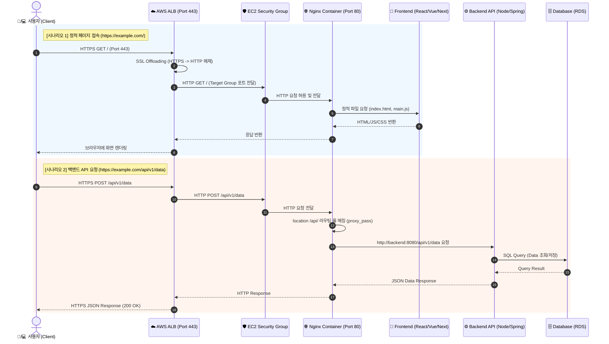

# AWS ALB - EC2 - Docker - Nginx - Frontend/Backend 아키텍처 다이어그램

````carousel

<!-- slide -->

````

---

## 1. 세부 컴포넌트 흐름 (Mermaid Sequence Diagram)



---

## 2. 계층별 핵심 역할 및 특징 정리

| 구분 | 컴포넌트 | 위치 / 네트워크 | 주요 역할 및 기술 스택 |
| :--- | :--- | :--- | :--- |
| **L7 Load Balancer** | **AWS ALB** | Public Subnet | • SSL/TLS Certificate (ACM) 종단<br>• 헬스체크(Health Check) 및 타겟 그룹 라우팅<br>• AWS WAF 연동으로 웹 보안 통제 |
| **Compute Host** | **AWS EC2** | Private/Public Subnet | • Docker Engine 구동 호스트<br>• 보안그룹(Security Group)으로 ALB 외부 IP만 수신 제한 |
| **Reverse Proxy** | **Nginx** | Docker Container (`bridge`) | • 단일 진입점 역할 (`:80`)<br>• `/api/` 요청 백엔드 프록시 (`proxy_pass`)<br>• 정적 파일(Frontend 빌드본) 초고속 직접 서빙 |
| **Web App** | **Frontend** | Docker Container | • React, Vue, Svelte, Next.js 등 사용자 인터페이스<br>• Static SPA 빌드 자원 제공 |
| **API Server** | **Backend** | Docker Container | • Spring Boot, Node.js, FastAPI, Django 등<br>• 비즈니스 로직 처리, JWT 인증, DB 연동 |

---

## 3. 핵심 아키텍처 포인트

> [!NOTE]
> **1. SSL Offloading (보안 및 연산 효율화)**
> 외부 인터넷 통신은 `HTTPS(443)`를 사용하지만, ALB가 SSL을 해제해 주므로 내부 EC2 및 Docker Nginx는 `HTTP(80)` 통신만 수행하여 암호화 연산 부담을 줄입니다.

> [!TIP]
> **2. CORS 문제 근본 해결**
> Frontend와 Backend가 모두 동일한 Nginx 역프록시 뒤에 위치하므로, 브라우저는 도메인과 포트가 동일하다고 인식하여 CORS(Cross-Origin Resource Sharing) 설정 이슈를 피할 수 있습니다.

> [!IMPORTANT]
> **3. 보안그룹 (Security Group) 최우선 격리**
> EC2 보안그룹의 인바운드 규칙을 `Anywhere(0.0.0.0/0)`가 아닌 **ALB의 보안그룹 ID**로만 지정함으로써, 인터넷에서 EC2로 직접 접속하려는 무단 침입을 차단합니다.
